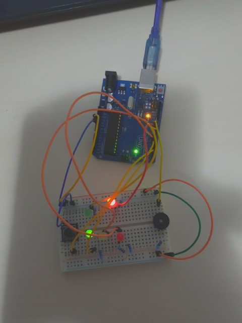
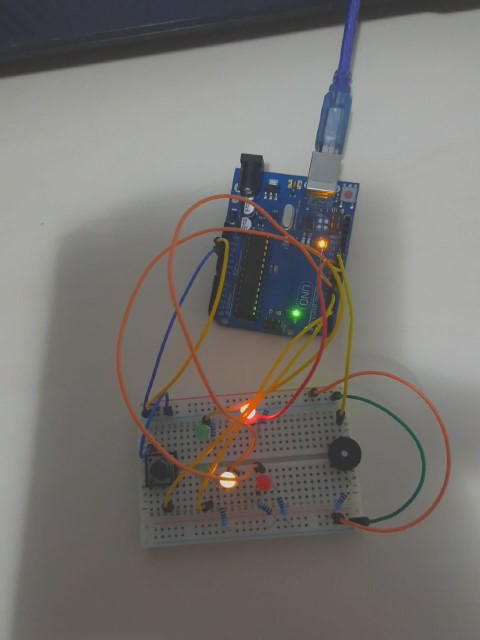
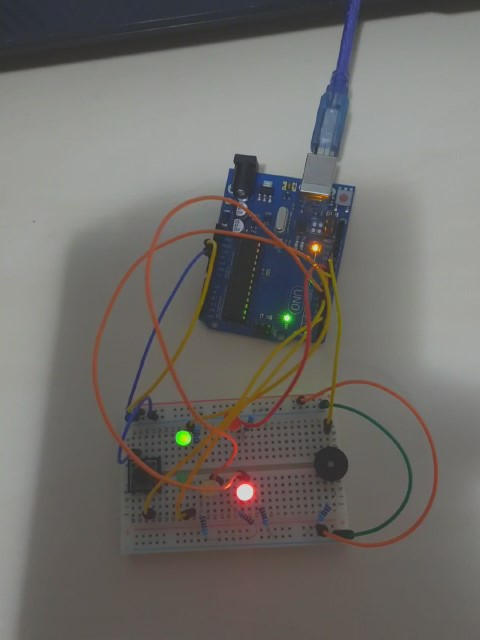

#Tema 2

Pentru tema 2 am avut de facut un fel de semafor pentru pietoni si mijloace de transport.
```
const int buttonPin = 2;
bool buttonState = LOW;
bool previousButtonState = LOW;
```
Am creat butonul care schimba prioritatea.
```
const int ledGreenCar = 5;
bool ledGreenCarState = HIGH;

const int ledYellowCar = 6;
bool ledYellowCarState = LOW;

const int ledRedCar = 7;
bool ledRedCarState = LOW;
```
Semaforul pentru mijloace de transport.
```
const int ledGreenPed = 8;
bool ledGreenPedState = LOW;

const int ledRedPed = 9;
bool ledRedPedState = HIGH;
```
Semaforul pentru pietoni.
```
const int buzzerPin =10;
unsigned int buzzerTone =1000;

```
La tema ne mai trebuia un buzzer.
```
bool reading = HIGH;
bool previousReading = HIGH;
int lastDebounceTimer  = 0;
int debounceInterval  = 50;

unsigned int timer1;
unsigned int lastTimer1;
unsigned int elapsedTime1;
const int intervalTimer1 = 700;

unsigned int timer2;
unsigned int lastTimer2;
unsigned int elapsedTime2;
const int intervalTimer2 = 500;

unsigned int timer3;
unsigned int lastTimer3;
unsigned int elapsedTime3;
const int intervalTimer3 = 1000;

void setup() {
  // put your setup code here, to run once:
  pinMode(buttonPin, INPUT_PULLUP);
  pinMode(buzzerPin,OUTPUT);
  pinMode(ledGreenCar,OUTPUT);
  pinMode(ledYellowCar,OUTPUT);
  pinMode(ledRedCar,OUTPUT);
  pinMode(ledGreenPed,OUTPUT);
  pinMode(ledRedPed,OUTPUT);
  Serial.begin(9600);
}

void loop() {
  // put your main code here, to run repeatedly:
  ```
  La inceput doar culoarea rosie la pietoni si culoare verde la mijloace de transport sunt in functiune. 
  
  ```
  digitalWrite(ledRedPed, ledRedPedState);
  digitalWrite(ledGreenCar, ledGreenCarState);
  ```
  Am folosit metoda de citire de la laborator (Debounce).
  ```
  reading = digitalRead(buttonPin);
  if(reading != previousReading){
    lastDebounceTimer  = millis();
  }
    
    
  if(millis() - lastDebounceTimer  > debounceInterval ){
    if(reading != buttonState) {
      buttonState = reading;
      if(buttonState == LOW)
    {
              
```
Am pornit un timer pana cand se schimba culoarea verde la mijloacele de transport in galben.
```
        timer1 = 0;
        lastTimer1 = 0;
        while(timer1 <= 10)
        {
          elapsedTime1 = millis();
          if(elapsedTime1 - lastTimer1 >= intervalTimer1)
          {
            tone(buzzerPin, buzzerTone,500);
            lastTimer1 = elapsedTime1;
            timer1++;
          }
               
        }
        ledGreenCarState = !ledGreenCarState;
        digitalWrite(ledGreenCar, ledGreenCarState);
        ledYellowCarState = !ledYellowCarState; 
        digitalWrite(ledYellowCar, ledYellowCarState);
```
Am pornit un al doilea timer pana cand seschimba culoarea galben la mijloacele de transport in rosu si rosu la pietoni in verde.

```
        timer2 = 0;
        lastTimer2 = 0;
        while(timer2 <= 3)
        {
          elapsedTime2 = millis();
          if(elapsedTime2 - lastTimer2 >= intervalTimer1)
          {
            tone(buzzerPin, buzzerTone, 300);
            lastTimer2 = elapsedTime2;
            timer2++;
          }
            
        }

        noTone(buzzerPin);
                
        
        ledYellowCarState = !ledYellowCarState; 
        digitalWrite(ledYellowCar, ledYellowCarState);
        
        ledRedCarState = !ledRedCarState;
        digitalWrite(ledRedCar, ledRedCarState);
        
        ledGreenPedState = !ledGreenPedState;
        digitalWrite(ledGreenPed, ledGreenPedState);
        
        ledRedPedState = !ledRedPedState;
        digitalWrite(ledRedPed, ledRedPedState);
```
Ultimul timer este folosit pana cand semaforul se intoarce in starea initiala.

```
        timer3 = 0;
        lastTimer3 = 0;
        while(timer3 <= 10)
        {
          elapsedTime3 = millis();
          if(elapsedTime3 - lastTimer3 >= intervalTimer3)
          {
            tone(buzzerPin, buzzerTone, 400);
            lastTimer3 = elapsedTime3;
            timer3++;
          }
            
        }
        noTone(buzzerPin);
        
        ledGreenCarState = !ledGreenCarState;
        digitalWrite(ledGreenCar, ledGreenCarState);
        ledRedCarState = !ledRedCarState;
        digitalWrite(ledRedCar, ledRedCarState);
        
        ledGreenPedState = !ledGreenPedState;
        digitalWrite(ledGreenPed, ledGreenPedState);
        
        ledRedPedState = !ledRedPedState;
        digitalWrite(ledRedPed, ledRedPedState);
    }
    }
  }
  previousReading = reading;

}
```
